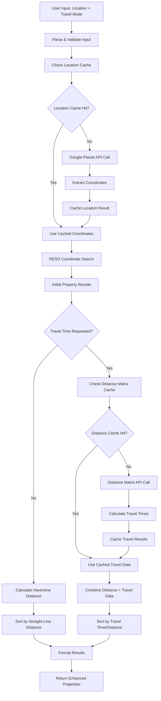
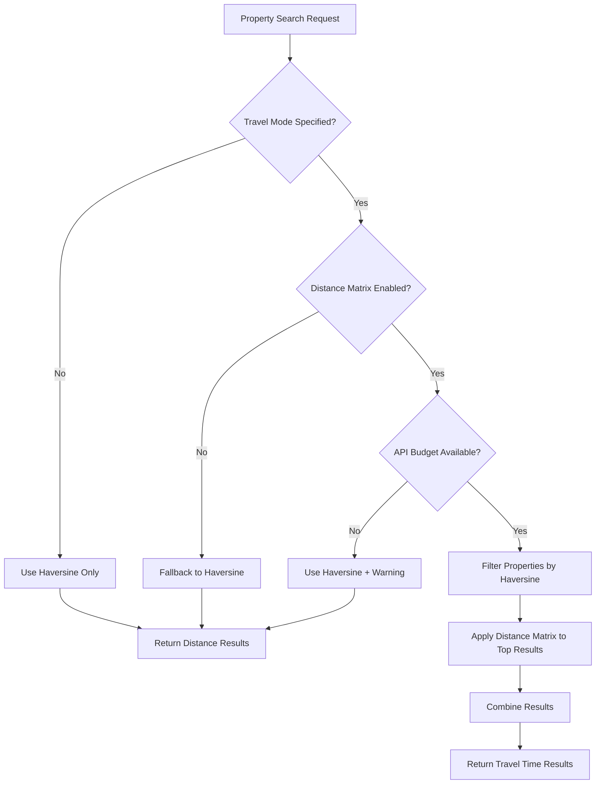

# Google Maps Places API Integration Plan

## Overview
This document outlines the integration of Google Maps Places API (New) with the UNLOCK RESO MCP Server to enable location-based property searches. The integration adds a new MCP tool `find_properties_near_location` that allows users to find homes near specific locations, points of interest, or landmarks.

## Technical Architecture

### Core Components

#### 1. Google Maps API Client (`src/utils/google_places_client.py`)
- **Purpose**: Unified interface for Google Maps APIs (Places & Distance Matrix)
- **Key Features**:
  - Location name to coordinates conversion via Places API
  - Nearby search functionality for points of interest
  - Travel distance and time calculations via Distance Matrix API
  - Cost-optimized field mask selection and API usage
  - Intelligent rate limiting and error handling
  - Multi-tier response caching for performance
  - Hybrid distance calculation strategy (Haversine + API)

#### 2. Enhanced Location Service (`src/utils/location_service.py`)
- **Purpose**: Orchestrate comprehensive location-based property searches
- **Key Features**:
  - Coordinate-based property search integration
  - Multi-modal distance calculations (straight-line + travel)
  - Travel time analysis and commute-based filtering
  - Location type classification and intelligent routing
  - Cost-aware API usage with fallback strategies
  - Batch processing for efficient distance calculations

#### 3. Enhanced MCP Server (`src/server.py`)
- **Enhanced Tool**: `find_properties_near_location` with travel time capabilities
- **Integration**: Seamless connection between Google Maps APIs and RESO property data
- **User Experience**: Natural language location inputs with travel mode options
- **Smart Routing**: Intelligent selection between straight-line and travel distance calculations

## Google Maps Places API (New) Integration

### API Specifications
- **Base URL**: `https://places.googleapis.com/v1/places:searchNearby`
- **Authentication**: API key in X-Goog-Api-Key header
- **Request Method**: HTTP POST
- **Field Mask**: Required to specify returned data fields

### Optimized Request Configuration
```json
{
  "includedTypes": ["establishment"],
  "maxResultCount": 1,
  "locationRestriction": {
    "circle": {
      "center": {
        "latitude": latitude,
        "longitude": longitude
      },
      "radius": radius_meters
    }
  },
  "rankPreference": "DISTANCE"
}
```

### Field Mask Optimization
- **Basic Fields**: `places.location,places.displayName`
- **Cost Tier**: Basic (lowest cost)
- **Rationale**: Minimal fields needed for coordinate extraction

### Rate Limiting Strategy
- **Default Limits**: 1000 requests per day (free tier)
- **Implementation**: Exponential backoff with jitter
- **Monitoring**: Request count tracking and alerting
- **Fallback**: Graceful degradation when limits exceeded

## Google Distance Matrix API Integration

### API Overview
The Google Distance Matrix API provides travel distance and time calculations between locations, enhancing the accuracy of location-based property searches beyond simple straight-line distances.

**Important Note**: Google has marked the Distance Matrix API as a "legacy product" and recommends checking for newer alternatives. However, it remains functional and widely used for distance calculations.

### API Specifications
- **Base URL**: `https://maps.googleapis.com/maps/api/distancematrix/json`
- **Authentication**: Same API key used for Places API
- **Request Method**: HTTP GET with query parameters
- **Response Format**: JSON with distance and duration data

### Request Configuration
```
GET https://maps.googleapis.com/maps/api/distancematrix/json
  ?destinations=30.2672,-97.7431
  &origins=30.2500,-97.7500
  &units=imperial
  &mode=driving
  &key=YOUR_API_KEY
```

### Travel Modes
- **driving** (default): Driving directions via road network
- **walking**: Walking directions via pedestrian paths
- **bicycling**: Bicycling directions via bike paths and roads
- **transit**: Public transportation directions (where available)

### Response Structure
```json
{
  "destination_addresses": ["Austin, TX, USA"],
  "origin_addresses": ["Austin, TX, USA"],
  "rows": [
    {
      "elements": [
        {
          "distance": {
            "text": "2.1 mi",
            "value": 3378
          },
          "duration": {
            "text": "8 mins",
            "value": 480
          },
          "status": "OK"
        }
      ]
    }
  ],
  "status": "OK"
}
```

### Enhanced Distance Calculations

#### Current vs Enhanced Approach

**Current Implementation (Haversine Formula)**:
- **Type**: Straight-line distance (as the crow flies)
- **Accuracy**: Geographic distance only
- **Speed**: Very fast, no API calls
- **Cost**: Free
- **Use Case**: General proximity filtering

**Enhanced Implementation (Distance Matrix API)**:
- **Type**: Actual travel distance via roads/transit
- **Accuracy**: Real-world travel conditions
- **Speed**: Dependent on API response time
- **Cost**: API usage charges apply
- **Use Case**: Commute analysis, travel time considerations

#### Hybrid Strategy
The optimal approach combines both methods:
1. **Initial Filtering**: Use Haversine for broad geographic filtering
2. **Precise Calculation**: Use Distance Matrix for final property rankings
3. **Intelligent Caching**: Cache frequent route calculations
4. **Cost Optimization**: Limit Distance Matrix calls to high-value queries

### Real Estate Applications

#### Travel Time Analysis
- **Commute-Based Search**: "Properties within 30-minute drive to downtown Austin"
- **School Access**: "Homes with <15-minute walk to elementary school"
- **Transit Proximity**: "Properties with <20-minute public transit to airport"
- **Multiple Destinations**: "Houses equidistant to both Dell and Apple campuses"

#### Market Analysis Enhancement
- **Accessibility Scoring**: Rank neighborhoods by travel time to key destinations
- **Commuter Market**: Identify properties appealing to specific workplace clusters
- **Transit-Oriented Development**: Analyze property values near transit stations
- **Multi-Modal Analysis**: Compare driving vs. walking vs. transit accessibility

### Cost Optimization Strategy

#### API Usage Tiers
- **Free Tier**: $200 monthly credit (≈40,000 distance calculations)
- **Paid Usage**: $0.005 per element (origin-destination pair)
- **Volume Discounts**: Available for high-usage applications

#### Smart Usage Patterns
1. **Batch Requests**: Calculate multiple destinations in single API call
2. **Selective Application**: Use only for properties meeting initial criteria
3. **Caching Strategy**: Store results for common origin-destination pairs
4. **Fallback Logic**: Use Haversine when budget constraints apply

#### Cost Control Implementation
```python
# Pseudo-code for cost-aware distance calculation
def calculate_distance(origin, destination, use_api=False):
    if use_api and api_budget_available():
        return distance_matrix_api_call(origin, destination)
    else:
        return haversine_calculation(origin, destination)
```

### Integration Architecture

#### Enhanced Location Service
The existing Location Service will be extended to support Distance Matrix calculations:

```python
class LocationService:
    def calculate_travel_distance(self, origin, destination, mode='driving'):
        """Calculate actual travel distance and time."""
        pass

    def batch_travel_calculations(self, origin, destinations, mode='driving'):
        """Efficiently calculate distances to multiple destinations."""
        pass

    def get_properties_by_commute_time(self, origin, max_minutes, mode='driving'):
        """Find properties within specified travel time."""
        pass
```

#### Caching Strategy
- **Cache Key**: `origin_lat,lon:dest_lat,lon:mode:units`
- **TTL**: 7 days for driving, 24 hours for transit (schedule-dependent)
- **Cache Size**: LRU with configurable maximum entries
- **Invalidation**: Time-based expiry with manual refresh capability

### Configuration Settings

#### Environment Variables
```bash
# Distance Matrix API Configuration
GOOGLE_DISTANCE_MATRIX_ENABLED=true
GOOGLE_DISTANCE_MATRIX_DEFAULT_MODE=driving
GOOGLE_DISTANCE_MATRIX_UNITS=imperial
GOOGLE_DISTANCE_MATRIX_CACHE_TTL_DAYS=7
GOOGLE_DISTANCE_MATRIX_MAX_DAILY_REQUESTS=1000
```

#### Settings Integration
```python
# src/config/settings.py additions
google_distance_matrix_enabled: bool = Field(default=False, env="GOOGLE_DISTANCE_MATRIX_ENABLED")
google_distance_matrix_default_mode: str = Field(default="driving", env="GOOGLE_DISTANCE_MATRIX_DEFAULT_MODE")
google_distance_matrix_units: str = Field(default="imperial", env="GOOGLE_DISTANCE_MATRIX_UNITS")
google_distance_matrix_cache_ttl_days: int = Field(default=7, env="GOOGLE_DISTANCE_MATRIX_CACHE_TTL_DAYS")
google_distance_matrix_max_daily_requests: int = Field(default=1000, env="GOOGLE_DISTANCE_MATRIX_MAX_DAILY_REQUESTS")
```

## Implementation Details

### 1. Enhanced Location Resolution Workflow



### 2. Hybrid Distance Calculation Strategy



### 3. Enhanced MCP Tool Schema

```json
{
  "name": "find_properties_near_location",
  "description": "Find properties near a specific location with optional travel time analysis using Google Maps APIs",
  "inputSchema": {
    "type": "object",
    "properties": {
      "location": {
        "type": "string",
        "description": "Location name, address, business name, or point of interest (e.g., 'Austin City Hall', '123 Main St, Austin TX', 'Starbucks on 6th Street')"
      },
      "radius_miles": {
        "type": "number",
        "description": "Search radius in miles (used for initial geographic filtering)",
        "default": 1.0,
        "minimum": 0.1,
        "maximum": 10.0
      },
      "travel_mode": {
        "type": "string",
        "enum": ["driving", "walking", "bicycling", "transit"],
        "description": "Travel mode for distance calculations (requires Distance Matrix API)",
        "default": "driving"
      },
      "max_travel_time_minutes": {
        "type": "integer",
        "description": "Maximum travel time in minutes (enables travel time filtering)",
        "minimum": 1,
        "maximum": 120
      },
      "use_travel_time": {
        "type": "boolean",
        "description": "Enable travel time calculations using Distance Matrix API",
        "default": false
      },
      "property_filters": {
        "type": "object",
        "description": "Standard RESO property search filters",
        "properties": {
          "min_price": {"type": "integer"},
          "max_price": {"type": "integer"},
          "min_bedrooms": {"type": "integer"},
          "max_bedrooms": {"type": "integer"},
          "property_type": {"type": "string"},
          "status": {"type": "string"}
        }
      },
      "limit": {
        "type": "integer",
        "description": "Maximum number of properties to return",
        "default": 25,
        "minimum": 1,
        "maximum": 100
      }
    },
    "required": ["location"]
  }
}
```

### 3. Error Handling Strategy

#### Google Places API Errors
- **401 Unauthorized**: Invalid API key → User-friendly error message
- **429 Rate Limited**: Quota exceeded → Retry with exponential backoff
- **400 Bad Request**: Invalid location → Suggest alternative search terms
- **404 Not Found**: Location not found → Provide search tips

#### Fallback Mechanisms
1. **Location Not Found**: Suggest partial matches or nearby alternatives
2. **No Properties**: Expand search radius automatically (up to 5 miles)
3. **API Unavailable**: Fall back to direct coordinate input if available
4. **Rate Limits**: Queue requests and process when quota resets

### 4. Cost Optimization

#### API Usage Optimization
- **Field Selection**: Use minimal field mask for cost efficiency
- **Caching Strategy**: 24-hour cache for location resolutions
- **Request Deduplication**: Prevent duplicate API calls within session
- **Radius Limits**: Constrain search radius to prevent excessive results

#### Monitoring and Alerting
- **Usage Tracking**: Monitor daily API quota consumption
- **Cost Alerts**: Notify when approaching usage limits
- **Performance Metrics**: Track response times and success rates

## Real Estate Use Cases

### 1. Commute-Based Buyer Scenarios
```
# Traditional Distance-Based (Existing)
"Find homes under $500k within 1 mile of Dell Technologies Austin"
"3+ bedroom houses within 2 miles of Austin-Bergstrom Airport"

# Enhanced Travel Time-Based (New with Distance Matrix)
"Properties with <30-minute drive to downtown Austin under $600k"
"Homes within 45-minute commute to Apple campus by car"
"3+ bedroom houses with <20-minute drive to Dell Technologies"
"Properties with <15-minute walk to nearest MetroRail station"
"Condos within 25-minute public transit commute to UT campus"
```

### 2. Multi-Modal Transportation Analysis
```
# Driving Accessibility
"Properties within 30-minute drive to both IBM and Samsung Austin"
"Homes with <40-minute drive to Austin-Bergstrom during rush hour"

# Walking/Biking Access
"Houses within 10-minute bike ride to Town Lake Trail"
"Properties with <5-minute walk to elementary school"
"Condos within 15-minute walk to Whole Foods Market"

# Public Transit Integration
"Homes within 20-minute bus ride to downtown Austin"
"Properties near MetroRail with <45-minute transit to airport"
"Student housing within 30-minute CapMetro commute to UT"
```

### 3. Investment and Market Analysis Scenarios
```
# Commuter Market Investment
"Properties appealing to Dell/Apple/IBM employees (30-min commute zone)"
"Investment properties near major employment corridors"
"Multi-family properties with <45-minute commute to tech hubs"

# Transit-Oriented Development
"Properties within 0.5 miles of planned light rail stations"
"Homes with improving transit accessibility (pre-development investment)"
"Commercial properties near high-frequency bus routes"

# School District Accessibility
"Family homes within 20-minute drive to top-rated elementary schools"
"Properties in neighborhoods with walkable school access"
"Investment properties near multiple school options"
```

### 4. Lifestyle and Accessibility Scenarios
```
# Recreation and Entertainment
"Houses within 15-minute bike ride to Zilker Park"
"Properties with <10-minute walk to Lady Bird Lake Trail"
"Homes within 30-minute drive to Lake Travis recreation areas"

# Urban Convenience
"Condos within 5-minute walk to grocery stores and restaurants"
"Properties with <20-minute access to Austin-Bergstrom by any mode"
"Homes within walking distance of farmer's markets and entertainment"

# Healthcare and Services
"Properties within 15-minute drive to major medical centers"
"Senior-friendly homes with <10-minute drive to healthcare facilities"
"Family properties near pediatric care and urgent care facilities"
```

### 5. Comparative Analysis Use Cases
```
# Multi-Destination Optimization
"Properties equidistant to both spouse's workplaces (minimize total commute)"
"Homes optimizing access to work, school, and recreation simultaneously"
"Investment properties with balanced access to multiple employment centers"

# Trade-off Analysis
"Compare: 5-minute farther from work vs. 10-minute closer to school"
"Properties optimizing commute time vs. property value"
"Analyze: downtown condo (short commute) vs. suburban house (space)"
```

### 6. Enhanced Search Examples with Travel Modes
```
# Mode-Specific Searches
{
  "location": "Austin City Hall",
  "travel_mode": "driving",
  "max_travel_time_minutes": 30,
  "property_filters": {"min_bedrooms": 3, "max_price": 500000}
}

{
  "location": "University of Texas at Austin",
  "travel_mode": "walking",
  "max_travel_time_minutes": 15,
  "property_filters": {"property_type": "condo", "max_price": 300000}
}

{
  "location": "Dell Technologies Round Rock",
  "travel_mode": "transit",
  "max_travel_time_minutes": 45,
  "property_filters": {"min_bedrooms": 2, "max_price": 400000}
}
```

## Configuration and Setup

### Environment Variables
```bash
# Google Maps API Configuration (Places API)
GOOGLE_MAPS_API_KEY=your_google_maps_api_key_here
GOOGLE_MAPS_CACHE_TTL_HOURS=24
GOOGLE_MAPS_MAX_REQUESTS_PER_DAY=800
GOOGLE_MAPS_ENABLE_CACHING=true

# Google Distance Matrix API Configuration (Optional Enhancement)
GOOGLE_DISTANCE_MATRIX_ENABLED=false
GOOGLE_DISTANCE_MATRIX_DEFAULT_MODE=driving
GOOGLE_DISTANCE_MATRIX_UNITS=imperial
GOOGLE_DISTANCE_MATRIX_CACHE_TTL_DAYS=7
GOOGLE_DISTANCE_MATRIX_MAX_DAILY_REQUESTS=1000
```

### Settings Configuration
```python
# src/config/settings.py additions
# Google Places API Settings
google_maps_api_key: str = Field(default="", env="GOOGLE_MAPS_API_KEY")
google_maps_cache_ttl_hours: int = Field(default=24, env="GOOGLE_MAPS_CACHE_TTL_HOURS")
google_maps_max_requests_per_day: int = Field(default=800, env="GOOGLE_MAPS_MAX_REQUESTS_PER_DAY")
google_maps_enable_caching: bool = Field(default=True, env="GOOGLE_MAPS_ENABLE_CACHING")

# Google Distance Matrix API Settings (Optional)
google_distance_matrix_enabled: bool = Field(default=False, env="GOOGLE_DISTANCE_MATRIX_ENABLED")
google_distance_matrix_default_mode: str = Field(default="driving", env="GOOGLE_DISTANCE_MATRIX_DEFAULT_MODE")
google_distance_matrix_units: str = Field(default="imperial", env="GOOGLE_DISTANCE_MATRIX_UNITS")
google_distance_matrix_cache_ttl_days: int = Field(default=7, env="GOOGLE_DISTANCE_MATRIX_CACHE_TTL_DAYS")
google_distance_matrix_max_daily_requests: int = Field(default=1000, env="GOOGLE_DISTANCE_MATRIX_MAX_DAILY_REQUESTS")
```

### API Cost Considerations

#### Combined API Usage Strategy
- **Places API**: Primary for location resolution (1000 free requests/day)
- **Distance Matrix API**: Optional for travel time calculations ($0.005 per element)
- **Hybrid Approach**: Use Places for basic searches, Distance Matrix for precise commute analysis
- **Budget Management**: Configurable daily limits prevent unexpected charges

#### Cost Optimization Tips
1. **Enable Caching**: Reduces repeat API calls for common locations/routes
2. **Batch Calculations**: Process multiple destinations in single Distance Matrix requests
3. **Selective Usage**: Apply travel time calculations only to top property candidates
4. **Fallback Strategy**: Use Haversine calculations when API budgets are exhausted

## Performance Considerations

### Caching Strategy
- **Location Cache**: Store successful location → coordinate resolutions
- **TTL**: 24 hours for most locations, 1 hour for dynamic locations
- **Cache Key**: Normalized location string hash
- **Storage**: In-memory with LRU eviction

### Response Time Optimization
- **Target**: < 3 seconds total response time
- **Google Places**: < 1 second for location resolution
- **RESO Search**: < 2 seconds for property retrieval
- **Parallel Processing**: Concurrent API calls where possible

### Scalability Considerations
- **Rate Limiting**: Implement per-user quotas if needed
- **Load Balancing**: Distribute API calls across multiple keys if required
- **Monitoring**: Track usage patterns and optimize accordingly

## Testing Strategy

### Unit Tests
```python
# Test coverage areas
- GooglePlacesClient: API interaction and error handling
- LocationService: Coordinate resolution and validation
- MCP Tool: Input validation and response formatting
- Configuration: Settings validation and defaults
```

### Integration Tests
```python
# End-to-end scenarios
- Location resolution → Property search workflow
- Distance Matrix API integration and fallback behavior
- Travel time calculations across different modes
- Hybrid distance calculation strategy validation
- Error handling and fallback mechanisms
- Cache behavior and performance (location + distance caching)
- Rate limiting and retry logic for multiple APIs
- Cost optimization and API usage tracking
```

### Manual Testing Scenarios
```
# Common location types (Places API)
- Business names: "Starbucks", "Whole Foods Market"
- Landmarks: "Austin City Hall", "Texas State Capitol"
- Addresses: "123 Main St, Austin TX"
- Educational: "University of Texas", "Austin Community College"
- Transportation: "Austin-Bergstrom Airport", "Republic Square Station"

# Travel mode variations (Distance Matrix API)
- Driving: "Properties within 30-minute drive to downtown Austin"
- Walking: "Condos within 10-minute walk to UT campus"
- Bicycling: "Homes within 20-minute bike ride to Lady Bird Lake"
- Transit: "Properties within 45-minute bus ride to Dell Technologies"

# Hybrid calculation scenarios
- Large radius with travel time: "Properties within 5 miles OR 30-minute drive"
- Budget-constrained scenarios: API limits reached, fallback to Haversine
- Cache behavior: Repeated searches with same origin/destination pairs
- Error scenarios: Invalid travel modes, unreachable destinations
```

## Security and Privacy

### API Key Security
- **Storage**: Environment variables only, never in code
- **Rotation**: Regular API key rotation strategy
- **Monitoring**: Track unusual usage patterns
- **Restrictions**: IP and referrer restrictions where applicable

### Data Privacy
- **Location Data**: No persistent storage of user location searches
- **Caching**: Only technical data (coordinates), no personal information
- **Compliance**: GDPR and CCPA considerations for location data

## Migration and Deployment

### Deployment Checklist
- [ ] Google Maps API key configured
- [ ] Environment variables set
- [ ] Cache storage configured
- [ ] Rate limiting implemented
- [ ] Error handling tested
- [ ] Documentation updated
- [ ] User guides created

### Rollback Strategy
- **Feature Flag**: Ability to disable Google Places integration
- **Fallback Mode**: Graceful degradation to address-only searches
- **Monitoring**: Real-time error rate monitoring
- **Alerts**: Immediate notification of integration failures

## Future Enhancements

### Current Capabilities (Implemented)
1. **✅ Travel Time Analysis**: Distance Matrix API integration for commute calculations
2. **✅ Multi-Modal Transportation**: Support for driving, walking, bicycling, and transit
3. **✅ Cost-Aware Distance Calculations**: Hybrid Haversine + API approach
4. **✅ Travel Time Filtering**: Properties within specified commute times

### Potential Future Improvements
1. **Place Details Enhancement**: Expanded location information (reviews, ratings, photos)
2. **Advanced Route Optimization**: Multi-destination commute optimization
3. **Multiple Simultaneous Locations**: Search properties optimal for multiple points of interest
4. **Location History & Preferences**: User-specific location learning and suggestions
5. **Predictive Search**: Machine learning for location and commute pattern suggestions
6. **Real-Time Traffic Integration**: Dynamic travel time calculations with current traffic
7. **Accessibility Analysis**: ADA compliance and accessibility scoring for locations
8. **School District Integration**: Automatic school boundary and rating integration
9. **Public Transit Deep Integration**: Real-time transit schedules and service alerts

### API Evolution Strategy
- **Places API (New)**: Stay current with Google's latest features and field expansions
- **Distance Matrix Alternatives**: Monitor Google's recommendations for legacy API migration
- **Pricing Changes**: Continuous monitoring and adaptation to API pricing updates
- **New Google APIs**: Evaluate Routes API and other emerging Google Maps Platform services
- **Performance Optimization**: Implement advanced caching strategies and request batching

## Support and Troubleshooting

### Common Issues
1. **Location Not Found**: Verify spelling and try alternative names
2. **No Properties**: Increase search radius or adjust filters
3. **API Errors**: Check API key and quota status
4. **Slow Response**: Review cache configuration and API performance

### Monitoring Dashboard
- **API Usage**: Daily quota consumption
- **Error Rates**: Success/failure ratios
- **Response Times**: Average and 95th percentile
- **Cache Hit Rate**: Efficiency of location caching

### Support Documentation
- **User Guide**: How to use location-based search effectively
- **Troubleshooting**: Common issues and solutions
- **API Reference**: Complete tool documentation
- **Best Practices**: Optimization tips for users

## Conclusion

The enhanced Google Maps integration brings comprehensive location intelligence to the UNLOCK RESO MCP Server through a powerful combination of Places API and Distance Matrix API capabilities. This integration transforms basic location searches into sophisticated real estate discovery tools that account for real-world travel patterns and commute considerations.

### Integration Highlights

**Dual API Strategy**: The hybrid approach leverages Places API for location resolution and Distance Matrix API for precise travel time calculations, providing users with both geographic proximity and practical accessibility insights.

**Cost-Conscious Design**: The implementation prioritizes cost efficiency through intelligent caching, selective API usage, and fallback strategies, ensuring powerful functionality without unexpected expenses.

**Real Estate Focus**: Every enhancement is designed specifically for property discovery scenarios, from commute-based filtering to multi-modal transportation analysis.

### Key Capabilities

- **🗺️ Natural Language Location Resolution**: Convert any location description into precise property searches
- **⏱️ Travel Time Analysis**: Real commute calculations across driving, walking, biking, and transit modes
- **🚗 Multi-Modal Transportation**: Support for diverse transportation needs and preferences
- **💰 Cost-Optimized Operations**: Intelligent API usage with comprehensive caching and fallback strategies
- **🔄 Hybrid Distance Calculations**: Seamless integration of straight-line and travel-based distance metrics
- **📍 Enhanced Property Context**: Properties enriched with both geographic and accessibility information

### Real Estate Market Impact

This integration enables sophisticated property discovery scenarios that reflect how people actually live and work:
- **Commuter-Focused Searches**: Properties within specific travel times to workplaces
- **Lifestyle-Based Discovery**: Homes near recreational and convenience destinations
- **Investment Analysis**: Properties with optimal accessibility for target demographics
- **Multi-Destination Optimization**: Properties that balance access to work, school, and recreation

### Technical Excellence

The implementation maintains the robust standards of the existing RESO MCP Server while adding powerful new capabilities:
- **Reliability**: Comprehensive error handling with graceful degradation
- **Performance**: Multi-tier caching and intelligent request optimization
- **Scalability**: Modular design supporting future enhancements and API evolution
- **Security**: Secure API key management and usage monitoring
- **Flexibility**: Configurable features allowing users to enable capabilities as needed

### Future-Ready Architecture

The modular design and configuration-driven approach ensure the integration can evolve with:
- **API Evolution**: Smooth migration to new Google Maps Platform services
- **Feature Expansion**: Easy addition of new location intelligence capabilities
- **Market Adaptation**: Flexible response to changing real estate discovery needs
- **Performance Optimization**: Continuous improvement of cost and speed efficiency

This enhanced location intelligence transforms the UNLOCK RESO MCP Server into a comprehensive real estate discovery platform that understands not just where properties are, but how accessible they are for real-world living and working patterns.